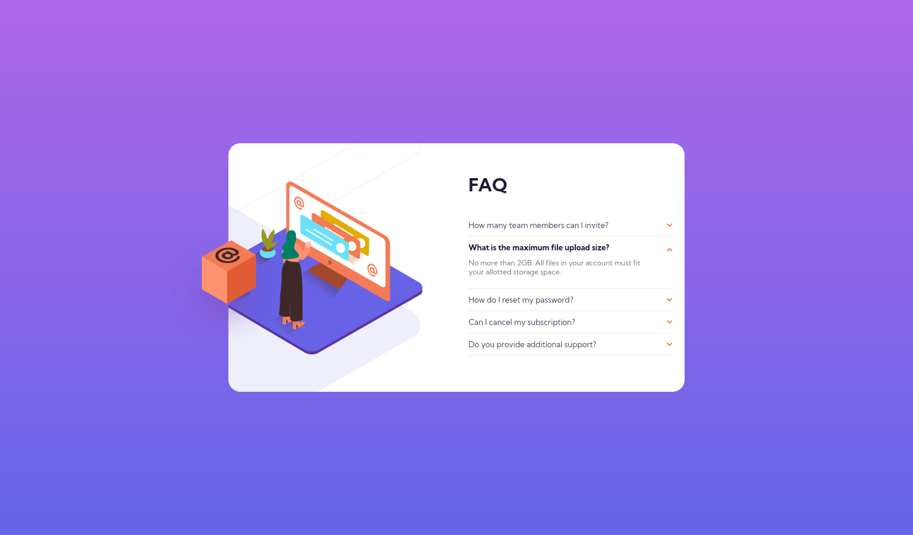

# Frontend Mentor - FAQ accordion card solution

This is a solution to the [FAQ accordion card challenge on Frontend Mentor](https://www.frontendmentor.io/challenges/faq-accordion-card-XlyjD0Oam). Frontend Mentor challenges help you improve your coding skills by building realistic projects.

## Table of contents

- [Overview](#overview)
  - [The challenge](#the-challenge)
  - [Screenshot](#screenshot)
  - [Links](#links)
- [My process](#my-process)
  - [Built with](#built-with)
  - [What I learned](#what-i-learned)
  - [Continued development](#continued-development)
- [Author](#author)

## Overview

### The challenge

Users should be able to:

- View the optimal layout for the component depending on their device's screen size
- See hover states for all interactive elements on the page
- Hide/Show the answer to a question when the question is clicked

### Screenshot

### Links

- Solution URL: [Solution](https://www.frontendmentor.io/solutions/faqaccordioncard-solution-using-css-grid-and-flexbox-prEaq68jl)
- Live Site URL: [Live Site](https://duncan91-ops.github.io/faq-accordion-card/)

## My process

### Built with

- Semantic HTML5 markup
- CSS custom properties
- Flexbox
- CSS Grid
- Mobile-first workflow

### What I learned

- CSS GRID
- POSITIONING
- RESPONSIVE LAYOUT
- CSS FLEXBOX
- STYLING IMAGES
- OVERFLOW
- DOM MANIPULATION

### Continued development

- ADVANCED DOM MANIPULATION
- RESPONSIVE LAYOUT
- MEDIA QUERIES

## Author

- Frontend Mentor - [@duncan91-ops](https://www.frontendmentor.io/profile/duncan91-ops)
